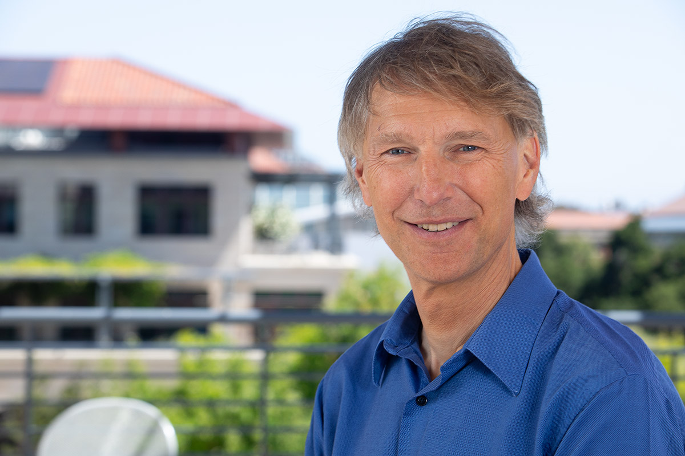

# Home

  

  **Alex Aiken** 
  Alcatel-Lucent Professor, Stanford University 
  Computer Science Division Director, SLAC
  

  { width="300" loading=lazy align=right }
  /// caption
  [past portraits](alternatepics.md)
  ///

## Contact Information {#contact}

- **Alex Aiken**
    - **Email**: [aaiken@stanford.edu](mailto:aaiken@stanford.edu)
    - **Office**: E462 CoDa
    - **Phone**: [650-725-3359](tel:+16507253359)

- **Assistant**
    - **Name**: Opeta Henderson
    - **Email**: [opetah@stanford.edu](mailto:opetah@stanford.edu)
    - **Phone**: [650-721-1166](tel:+16507211166)

## Biographical Sketch {#bio}

Alex Aiken is the Alcatel-Lucent Professor of Computer Science at Stanford. Alex received his
Bachelors degree in Computer Science and Music from [Bowling Green State
University](http://www.bgsu.edu/) in 1983 and his Ph.D. from [Cornell
University](http://www.cs.cornell.edu/) in 1988. Alex was a Research Staff Member at the [IBM
Almaden Research Center](http://www.almaden.ibm.com/) (1988-1993) and a Professor in the EECS
department at [UC Berkeley](http://www.eecs.berkeley.edu) (1993-2003) before joining the Stanford
faculty in 2003. His research interest is in areas related to programming languages. He is an ACM
Fellow, a recipient of ACM SIGPLAN's Programming Languages Achievement Award and Phi Beta Kappa's
Teaching Award, and a former chair of the Stanford Computer Science Department.

Alex is married to [Jennifer Widom](http://www-db.stanford.edu/people/widom.html). Jennifer and Alex
have a son [Tim](http://timaiken.org) and a daughter
[Emily](https://www.ischool.berkeley.edu/people/emily-aiken).
[Here](http://www-db.stanford.edu/~widom/travel.html) are some photos from the family's travels.

## Announcements

- 2/2024 Here are the talks and slides from the 2024 [Legion
  Retreat](https://legion.stanford.edu/retreat2024/).

## Teaching {#teaching}

- [CS242: Programming Languages](http://www.stanford.edu/class/cs242)
- [CS315B: Programming Supercomputers](http://www.stanford.edu/class/cs315b)
- My publicly available, free, self-study [compilers
  course](https://www.edx.org/course/compilers). The course covers the essentials of compiler
  construction, plus material on language design and semantics, optimization, and bit on the history
  of programming languages. There are optional programming assignments for hard-core enthusiasts who
  want to build a full, functioning compiler for
  [COOL](http://theory.stanford.edu/~aiken/software/cooldist), the Classroom Object Oriented
  Language.
- [Stanford Software Seminar](sss.md)
- The weekly software [research lunch](http://software-research-lunch.stanford.edu).

## Research Projects {#research}

- [FlexFlow](https://flexflow.ai) is a system for automatically finding fast parallelization
  strategies for deep learning training and inference. FlexFlow is built on Legion (see below).
- [Legion](http://legion.stanford.edu) is a programming system for heterogenous, parallel machines
  with complex memory hierarchies.
  - A [Regent tutorial](http://theory.stanford.edu/~aiken/regent.zip)
  - A [Legion tutorial](http://theory.stanford.edu/~aiken/ecp)

I also maintain a page of [past research projects](pastprojects.md) and a set of
[pages](http://theory.stanford.edu/~aiken/misc/index.html) internal to current projects.

## Miscellany {#misc}

- Here's a recent [trip
  report](https://medium.com/@aaiken/the-50-to-80-a-tahoe-ski-traverse-59cce89bd0d8) from a winter
  crossing of the wilderness areas west of Lake Tahoe.
- I gave the commencement speech at CS graduation during the time I was department chair (well, I
  did miss one year ...). I've received requests for links to those speeches, so here they are:
  [2015](http://theory.stanford.edu/~aiken/talks/commencements/Commencement2015.pdf),
  [2017](http://theory.stanford.edu/~aiken/talks/commencements/Commencement2017.pdf), and
  [2018](http://theory.stanford.edu/~aiken/talks/commencements/Commencement2018.pdf).
- If my bio is too short for you, People of PLDI has published an [interview with
  me](http://abstract.ece.cmu.edu/peopleOfPLDI/aiken.html), along with a number of other [PL
  researchers](http://abstract.ece.cmu.edu/peopleOfPLDI/index.html).
- In 2018 I celebrated the (almost) end of my term as department chair by hiking the Sierra High
  Route. [Here is the trip report.](https://medium.com/@aaiken/sierra-high-route-2018-a100eb3aabaa)
- [Advice for Program Chairs](publications/trs/ProgramChair.pdf) distills my experience (and things
  I've learned from many other people) as a program chair for POPL and PLDI.
- I delivered a [memorial](other/backus.pdf) for John Backus at PLDI'07.
- My family took most of the '07-'08 academic year off to travel the world. Those with too much time
  on their hands can check out the trip's [web
  page](http://infolab.stanford.edu/~widom/yearoff.html).

## Current Ph.D. and Postdoctoral Students {#students}

- [Benjamin Driscoll](https://github.com/willtunnels)
- Qiantan Hong
- [Rupanshu Soi](https://rupanshusoi.github.io/)
- [Colin Unger](https://www.lockshaw.io/)
- [Tony Wang](https://github.com/marsupialtail/quokka)
- [Anjiang Wei](https://cs.stanford.edu/~anjiang/)
- [Rohan Yadav](https://rohany.github.io/)
- [David Zhang](https://www.dkzhang.com/)
